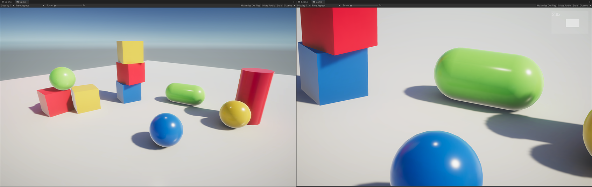

# Off-axis projection demo: Scene Magnifier



A tiny Unity demo showcasing how a custom off-axis projection matrix can be used to build a "scene magnifier". You can scroll to zoom, LMB drag to pan the view, just like an image viewer, but with loseless image and infinite zoom level (like a vector graphics). Different from adjusting camera rotation and FOV angle, using a off-axis projection matrix to zoom in will not change the "perspective relationship" of the original shot (like on the top-left image).

This method can be extented to build a display array (like on a stage), with each screen being rendered by different computer using the same scene, but with different projection matrix (this custom projection matrix can also be used to cull objects!), to average the computational load.

This method can also be used to make a super-resolution screenshot tool, by dividing the screen into several smaller grids and use the custom projection matrices to capture them individually (Nvidia Ansel already did that!). This approach avoids hitting GPU texture size limit, which is 16384x16384 on dx11 and dx12, when allocating huge render targets.

---

The core code is so simple and self-explanatory, I can just paste them here:

```csharp
// range from (-1, -1) to (1, 1) inclusive, with (-1, -1) being screen's lower-left, and (1, 1) being screen's upper-right
void SetMagnifyRegion(float xmin, float ymin, float xmax, float ymax)
{
    // Retrive camera properties
    float n = camera.nearClipPlane;
    float f = camera.farClipPlane;
    float fovy = camera.fieldOfView; // in degrees, uses verticle fov (fovy)
    float aspect = camera.aspect; // width / height

    // Calculate l, r, b, t
    float ogT = Mathf.Tan(fovy / 2f * Mathf.Deg2Rad) * n;
    float ogR = ogT * aspect;

    float l = ogR * xmin;
    float r = ogR * xmax;
    float b = ogT * ymin;
    float t = ogT * ymax;

    Matrix4x4 persp = Matrix4x4.Frustum(l, r, b, t, n, f);
    camera.projectionMatrix = persp;
    camera.cullingMatrix = persp * camera.worldToCameraMatrix;
}
```

